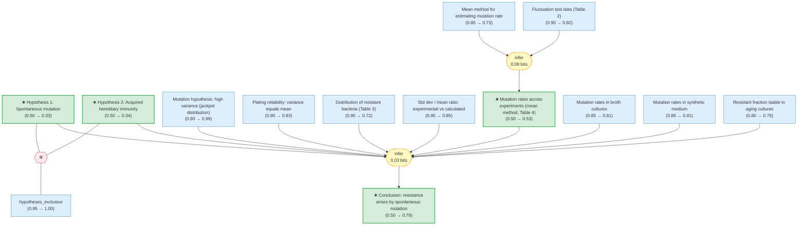

# luria-delbruck-fluctuation-gaia

> **Original work:** Luria, S. E. & Delbruck, M. "Mutations of Bacteria from Virus Sensitivity to Virus Resistance." *Genetics* 28, 491-511 (1943).

<!-- badges:start -->
<!-- badges:end -->

> [!NOTE]
> This README is an AI-generated analysis based on a [Gaia](https://github.com/SiliconEinstein/Gaia) reasoning graph formalization of the original work. Belief values reflect the graph's probabilistic assessment of each claim's support, not the original authors' confidence. See [ANALYSIS.md](ANALYSIS.md) for detailed verification results.

## Summary

Luria and Delbruck's 1943 paper resolves a fundamental question in microbiology: does bacterial resistance to bacteriophage arise by spontaneous mutation before virus exposure, or by virus-induced acquired immunity? The authors design an elegant statistical test -- the "fluctuation test" -- exploiting the fact that these two hypotheses make sharply different predictions about the variance of resistant colony counts across replicate cultures. Under acquired immunity, resistance events are independent and counts should follow a Poisson distribution (variance = mean). Under spontaneous mutation, early mutations produce large clones of resistant bacteria, generating enormous variance with characteristic "jackpot" cultures. Across dozens of experiments with *E. coli* B and phage alpha, the observed variance exceeds the mean by 100-600x, decisively refuting acquired immunity and supporting spontaneous mutation. The reasoning graph assigns the main conclusion -- that resistance arises by heritable spontaneous mutation -- a belief of 0.78, reflecting strong convergent evidence from multiple experimental lines.

## Overview

> [!TIP]
> **Reasoning graph information gain: `0.1 bits`**
>
> Total mutual information between leaf premises and exported conclusions -- measures how much the reasoning structure reduces uncertainty about the results.

> [!NOTE]
> **[Per-module reasoning graphs with full claim details →](docs/detailed-reasoning.md)**
>
> 6 Mermaid diagrams (one per section) with every claim, strategy, and belief value.

## Reasoning Structure

### The two competing hypotheses remain near equipoise in the coarsened graph (mutation: 0.33, acquired immunity: 0.34)

The mutation hypothesis proposes that any bacterium may spontaneously mutate to resistance at a fixed rate per unit time, independently of virus exposure. The acquired immunity hypothesis proposes that resistance is conferred by surviving virus attack. These hypotheses are modeled as mutually exclusive (contradiction operator, belief: 1.00).

In the full factor graph, the abduction structure -- where the mutation hypothesis explains the observed high variance with prior 0.9 while the immunity hypothesis fails to explain it with prior 0.1 -- sharply differentiates the two. However, in the coarsened overview graph, the internal structure of the abduction (the compare operator, the two asymmetric support strategies) is collapsed into a single composite strategy node. This coarsening loses the discriminative signal: both hypotheses appear as premises of the same strategy feeding the main conclusion, and their beliefs converge near the uninformative prior of 0.50. The contradiction operator then pushes both slightly below 0.50 (to 0.33 and 0.34), since it penalizes both being simultaneously true.

**The full-resolution beliefs are more informative.** Within the detailed per-module graph, the abduction correctly assigns much stronger support to the mutation hypothesis over acquired immunity. The coarsened graph's near-equipoise is a visualization artifact, not a scientific conclusion.

### Mutation rates are consistent across diverse experimental conditions (belief: 0.53)

A key quantitative prediction of the mutation hypothesis is that the mutation rate $a$ -- the probability of mutation per bacterium per physiological time unit -- should be a fixed constant, independent of experimental conditions. Using the mean method (equation 8: $r = a N_t \ln(N_t C a)$), Luria and Delbruck estimate $a$ from 10 independent experiments spanning 10 cc and 0.2 cc culture volumes, broth and synthetic media, and series of 5 to 100 cultures. The values cluster tightly: $1.1$ to $4.1 \times 10^{-8}$ mutations per bacterium per time unit, with an average of $2.45 \times 10^{-8}$.

This consistency is remarkable. Broth cultures and synthetic medium cultures grow at different rates and under different metabolic conditions, yet their mutation rates overlap. Large and small culture volumes produce comparable estimates. This cross-condition consistency provides evidence independent of the variance argument: the mutation hypothesis not only explains the statistical pattern but also yields a reproducible quantitative parameter.

An alternative estimation method -- the $p_0$ method, based on the fraction of cultures with zero resistant bacteria -- gives a lower value ($0.47 \times 10^{-8}$ for Experiment 23). The discrepancy is itself informative: the mean method is inflated by jackpot cultures from early mutations, which contribute disproportionately to the average but do not affect the zero-count fraction. This internal tension (belief: 0.61) is consistent with the mutation hypothesis rather than contradicting it.

**Evidence support:**
- **Broth culture experiments** (belief: 0.81): Five independent experiments yield rates from $1.4$ to $4.1 \times 10^{-8}$.
- **Synthetic medium experiments** (belief: 0.81): Four experiments yield rates from $1.1$ to $3.0 \times 10^{-8}$, overlapping with broth values despite different growth conditions.
- **Cross-method discrepancy** (belief: 0.61): The 5x difference between the $p_0$ and mean methods is qualitatively explained by the jackpot effect but not rigorously quantified.

> The belief of 0.53 for the mean method mutation rate estimate reflects the moderate information gain (0.08 bits) from combining the Table 2 data with the theoretical formula. The underlying fixed mutation rate law itself achieves a higher belief of 0.84, supported by the induction over broth and synthetic medium experiments.

### Resistance in *E. coli* B arises by spontaneous heritable mutation (belief: 0.78)

This is the paper's central conclusion, integrating all evidence lines: (1) the fluctuation data's enormous variance rules out acquired immunity and matches the mutation prediction; (2) resistant bacteria appear in clonal groups, consistent with descent from common mutant ancestors; (3) mutation rate estimates are consistent across diverse experimental conditions (~$2.45 \times 10^{-8}$), confirming the core assumption of a fixed mutation rate. An additional supporting observation is that the fraction of resistant bacteria remains stable in aging cultures even as sensitive bacteria die, confirming that resistance is expressed constitutively in descendants rather than being induced by virus contact.

**Evidence support:**
- **Variance falsification of acquired immunity** (strongest chain): Observed variance 100-600x the mean in every experiment, with Poisson controls validating the measurement. The theoretical high-variance prediction reaches belief 0.99 with strong priors on the mathematical derivation.
- **Plating reliability control** (belief: 0.83): Three independent chi-squared tests confirm the measurement introduces only Poisson-level variation, ruling out methodological artifacts.
- **Consistent mutation rate** (belief: 0.84 for the fixed rate law): Cross-condition stability of $a$ via induction over broth and synthetic medium experiments.
- **Aging culture stability** (belief: 0.75): Constant resistant fraction over time supports constitutive resistance expression.
- **Std dev / mean ratio** (belief: 0.85): Quantitative confirmation that variance dramatically exceeds the mean across all conditions.

> The belief of 0.78 reflects the cumulative strength of convergent evidence from variance data, distribution shape, mutation rate consistency, and aging culture stability. The main conclusion draws on 10 leaf premises through multiple independent reasoning chains, making it robust to weakness in any single chain.

## Conclusions

| Label | Content | Prior | Belief |
|-------|---------|-------|--------|
| hypothesis_acquired_immunity | Hypothesis of acquired hereditary immunity: There is a small finite probabili... | 0.50 | 0.34 |
| hypothesis_mutation | Hypothesis of mutation: There is a finite probability per time unit for any b... | 0.50 | 0.33 |
| mutation_rate_mean_method | Using the mean method (equation 8: $r = a N_t \ln(N_t C a)$) across all exper... | 0.50 | 0.53 |
| resistance_is_heritable_mutation | The resistance to virus in *E. coli* B is due to a heritable change of the ba... | 0.50 | 0.78 |

<h2>Weak Points</h2>

The most notable structural issue is the coarsened graph's inability to differentiate the two competing hypotheses -- both land near 0.33-0.34 despite overwhelming evidence favoring mutation over acquired immunity in the full graph.

**Hypothesis differentiation lost in coarsening.** The abduction structure in `exp_fluctuation.py` uses asymmetric support priors (0.9 for mutation explaining variance, 0.1 for immunity explaining variance) plus a compare operator that strongly favors the mutation prediction. In the full factor graph, this drives a clear separation. However, the coarsened overview graph collapses the abduction into a single composite strategy node, and both hypotheses appear as undifferentiated premises. Their beliefs converge near 0.33-0.34 -- essentially uninformative modulo the contradiction penalty. This is a known limitation of the coarsening algorithm for abductive reasoning structures.

**Distribution fit only partially confirmed (belief: 0.59).** The fit between the observed and theoretical distributions for Experiment 23 is declared "satisfactory" for small values (0 and 1 resistant bacteria), but the paper notes that experimental standard deviation / mean ratios consistently exceed theoretical predictions. In Experiment 22, the experimental ratio is 7.8 versus a theoretical 1.5 -- a factor of 5 discrepancy attributed qualitatively to early mutations but never rigorously quantified. This is a genuine scientific weakness, not just a graph artifact.

**Mean method mutation rate estimate is moderate (belief: 0.53).** Despite strong input data (Table 2 at 0.82, theoretical formula at 0.73), the information gain from the inference step is only 0.08 bits, reflecting the limited discriminative power of a single inference step combining two moderately-believed premises.

**Mutation rate p0 vs mean method discrepancy (belief: 0.61).** The 5-fold difference between the two estimation methods ($0.47 \times 10^{-8}$ vs. $2.45 \times 10^{-8}$) is explained qualitatively by the jackpot effect but not resolved quantitatively. A maximum-likelihood estimator incorporating the full distribution would reconcile the methods.

<h2>Evidence Gaps & Future Work</h2>

**Experimental gaps:**

- **Single host-virus system.** All experiments use *E. coli* B with phage alpha. Whether the spontaneous mutation mechanism generalizes to other bacterial species, other bacteriophages, or other selective agents (antibiotics, chemicals) is untested. Extending the fluctuation test to additional systems would strengthen the main conclusion substantially.
- **No direct clonal tracking.** The paper infers clonal structure from the statistical pattern of colony counts. Direct isolation of a mutant clone and demonstration of heritable resistance through successive passages would provide independent, non-statistical confirmation. (This was later accomplished by the Newcombe spreading experiment and the Lederberg replica plating technique.)
- **No reverse mutation measurement.** The theory assumes reverse mutations are negligible but provides no measurement. If the reverse mutation rate were substantial, the effective forward mutation rate would be overestimated and the predicted clone sizes altered.

**Theoretical gaps:**

- **Excess variance unquantified.** The observed standard deviation / mean ratios consistently exceed theoretical predictions (e.g., 7.8 observed vs. 1.5 calculated in Exp. 22). The paper attributes this to early mutations before time $t_0$ but does not incorporate this correction into the theory. A refined model accounting for the full growth history would improve the quantitative match and the distribution fit.
- **Constant mutation rate assumption untested.** The theory assumes mutations occur at a constant rate per physiological time unit throughout the growth cycle. This is a simplifying assumption -- mutation rates may depend on growth phase, nutrient availability, or cell density. Direct measurement across growth phases would validate or constrain this assumption.
- **Hypothesis b1 not fully excluded.** The paper acknowledges that "acquired immunity of hereditarily predisposed individuals" -- where the capacity to resist is inherited but is only activated upon virus contact -- cannot be fully distinguished from the mutation hypothesis by fluctuation data alone. Both predict clonal grouping, though with different quantitative details.

**Computational gaps:**

- **p0 vs. mean method discrepancy.** The 5-fold difference between the two mutation rate estimation methods ($0.47 \times 10^{-8}$ vs. $2.45 \times 10^{-8}$) is explained qualitatively but not resolved quantitatively. A maximum-likelihood estimator incorporating the full distribution (not just the mean or zero-count fraction) would yield a more precise estimate and reconcile the two methods.

## Detailed Analysis

For structural integrity verification, standalone readability checks,
and complete package statistics, see [ANALYSIS.md](ANALYSIS.md).
